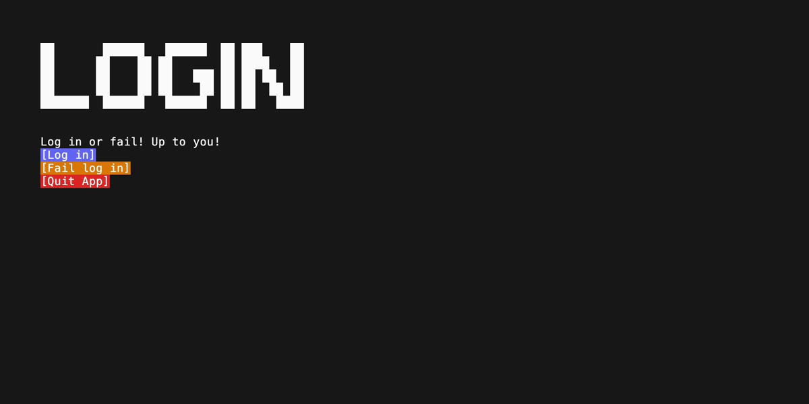
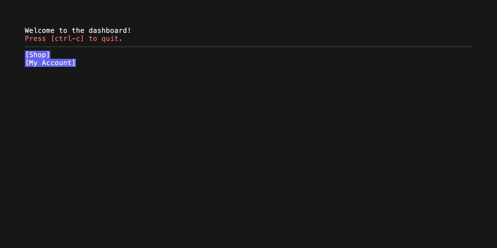
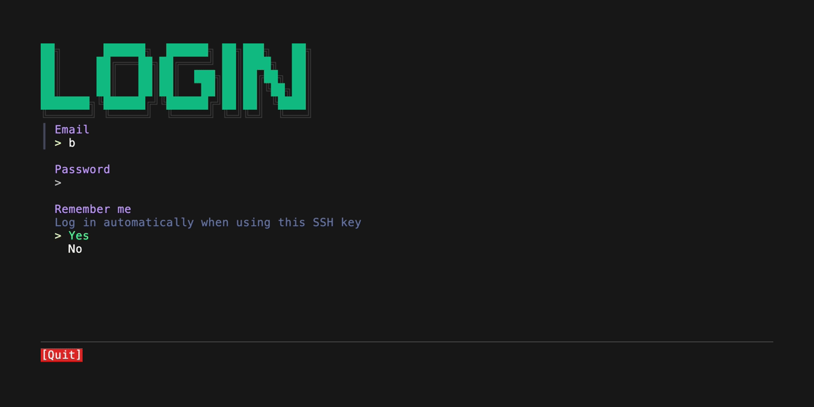
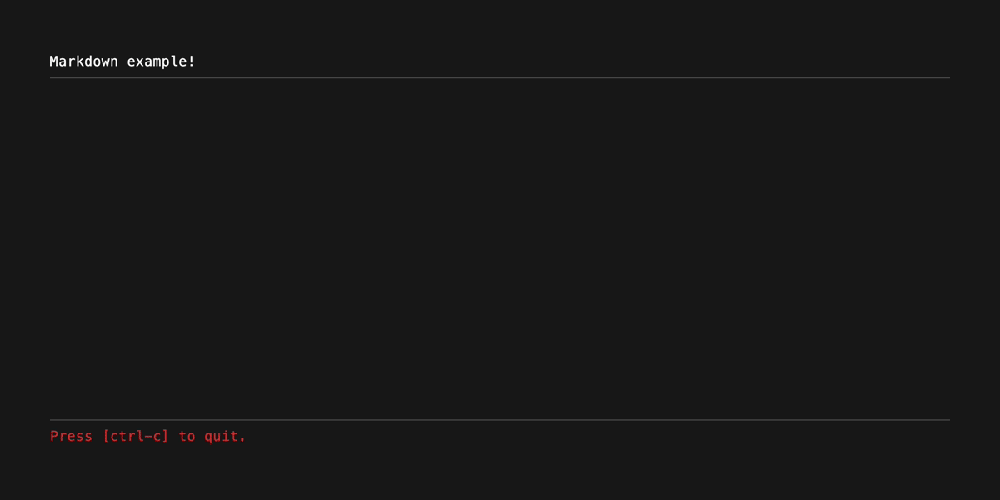

# BubbleApp

> [!WARNING]
> This is work in progress. Help is welcome.

BubbleApp is an opinionated app framework for BubbleTea. Using composable functional components and hooks it becomes easy to make large BubbleTea apps without too much code. See the examples for how it works.

## Features

- **[Functional components](#functional)**
  - Create large apps in a style familiar to a certain web framework. UseState hook for state and UseEffect hook for... well side-effects.
- **Layout Engine**
  - A multi-pass layout algorithm makes it possible to have growing components that take up available space. Enables resposive and flexible layouts.
- **Mouse support** - using [BubbleZone](https://github.com/lrstanley/bubblezone)
  - Automatic mouse handling and propagation for all components.
- **[Focus Management](#focus)**
  - Tab through your entire UI tree without any extra code. Tab order is the order in the UI tree.
- **[Theming](./style/style.go)**
  - Use the default provided theme or provide your own. A `style.Theme` uses named colors in a `style.Color` which are in turn defined by a provided `style.Palette`.

## Components

- **[Router](#router)**
  - Easy navigation with nested routes and outlets
- **Context Provider**
  - Share state and behavior with Contexts that can be consumed from any component below the Provider. This is how the Router works for example.
- **[Layout Components](#layout-components)**
  - [Stack](#stack) and Box makes it easy to create flexible layouts. (Responsive Grid Layout Component planned)
- **[Widget Components](#widget-components)**
  - Button, [Loader](#loader), [Tabs](#tabs), Text, [Markdown](#markdown), [Table](#table), [Forms](#form) and more to come...
- **Custom Components**
  - Make your own components. All the provided components are built with the same hooks you have access to

## How it works

BubbleApp works as an adaptor on top of BubbleTea. As a user of BubbleApp you will not have to interact with BubbleTea at all. That is abtracted away.

You provide a single function `app.FC` that takes in a Context `app.Ctx` and returns a "rendered" Component `app.C`. That is your App!

A rendered component is in the end just a string but in the form of a Component (`app.C`) that is registered with BubbleApp.

BubbleApp provides the means to Render a string with the render method:

`func (c *Ctx) Render(fn func(c *Ctx, props Props) string, props Props) C`

It might look complicated but it is esentially just wrapping a function call. It takes a function (`fn`) and some props. It then generates a unique ID for the component and prepares state for Hooks, Layout calculations and more.

In the end it then calls `fn` with the provided props which returns a string. This string is what is returned to BubbleTea and rendered on the screen.

### Minimal example

This is the smallest example of a BubbleApp program.

```go
package main

import (
  "os"
  "github.com/alexanderbh/bubbleapp/app"
  "github.com/alexanderbh/bubbleapp/component/text"
  tea "github.com/charmbracelet/bubbletea/v2"
)

// This is your root function that returns an app.C (which is a rendered string)
func NewRoot(c *app.Ctx) app.C {
  return text.New(c, "Hello World!")
}

func main() {
  c := app.NewCtx()

  bubbleApp := app.New(c, NewRoot) // Create a BubbleApp
  p := tea.NewProgram(bubbleApp, tea.WithAltScreen(), tea.WithMouseAllMotion())
  bubbleApp.SetTeaProgram(p) // Required: give BubbleApp a reference to your BubbleTea program
  if _, err := p.Run(); err != nil {
    os.Exit(1)
  }
}
```

---

## Examples

### [Multiple Views](./examples/multiple-views/login.go)

An example of multiple views with some buttons. The login model is forgotten when navigating away from that view. It is easier to maintain large apps this way instead of a single root model.



---

### [Process list](./examples/app-processes/main.go)

List all running processes in a table. This shows how to utilize the Global Data. Here a goroutine is maintaining the process list separately. Note: The API around updating components will change to something nice at some point.

There is not a lot of code here for the UI. Take a look.


---

## [Router](./examples/router/router.go)

Set up a router:

```go
func MainRouter(c *app.Ctx) app.C {
	return router.NewRouter(c, router.RouterProps{
		Routes: []router.Route{
			{Path: "/", Component: dashboard},
			{Path: "/shop", Component: shop},

			{Path: "/account", Component: account, Children: []router.Route{
				{Path: "/overview", Component: accountOverview},
				{Path: "/settings", Component: accountSettings},
				{Path: "/orders", Component: accountOrders},
			}},
		},
	})
}
```

How to navigate to a different route:

```go
button.New(c, "My Account", func() {
  router.Push("/account/overview")
})
```

Nested routes are rendered in an Outlet:

```go
router.NewOutlet(c)
```



---

## Widget Components

### [Tabs](./examples/tabs/main.go)

```go
var tabsData = []tabs.Tab{
  {Title: "Overview", Content: overview},
  {Title: "Loaders", Content: loaders},
  {Title: "Boxes 🟨", Content: boxes},
}

func NewRoot(c *app.Ctx) app.C {
	return tabs.New(c, tabsData)
}
```


---

### [Loader](./examples/loader/main.go)

```go
loader.New(c, loader.Dots, "Loading..."),
```


---

### [Table](./examples/table/main.go)

Each table automatically handles mouse hovering rows. They send out messages on state change and focus and keys are handled automatically.

```go
func NewRoot(c *app.Ctx) app.C {
	return stack.New(c, func(c *app.Ctx) []app.C {
		return []app.C{
			table.New(c, table.WithDataFunc(func(c *app.Ctx) ([]table.Column, []table.Row) {
				return clms, rows
			})),
			table.New(c, table.WithDataFunc(func(c *app.Ctx) ([]table.Column, []table.Row) {
				return clms, rows
			})),
		}
	}, stack.WithDirection(app.Horizontal))
}
```


---

### [Form](./examples/form/main.go)

Using [huh](https://github.com/charmbracelet/huh) for form rendering. Perhaps a native BubbleApp form will be created in the future for easier composability.

```go
var loginForm = huh.NewForm(
  huh.NewGroup(
    huh.NewInput().Key("email").Title("Email"),
    huh.NewInput().Key("password").Title("Password").EchoMode(huh.EchoModePassword),
    huh.NewSelect[string]().Key("rememberme").Title("Remember me").Description("Log in automatically when using this SSH key").Options(huh.NewOptions("Yes", "No")...),
  ),
)
```

```go
func NewRoot(c *app.Ctx) app.C {
	formSubmit, setFormSubmit := app.UseState[*FormData](c, nil)

	return stack.New(c, func(c *app.Ctx) []app.C {
		cs := []app.C{}
		cs = append(cs, c.Render(loginLogo, nil))

		if formSubmit == nil {
			cs = append(cs, form.New(c, loginForm, func() {
				setFormSubmit(&FormData{
					email:    loginForm.GetString("email"),
					password: loginForm.GetString("password"),
					remember: loginForm.GetString("rememberme"),
				})
			}))
		}

		if formSubmit != nil {
			cs = append(cs,
				text.New(c, "Email: "+formSubmit.email, nil),
				text.New(c, "Password 🙈: "+formSubmit.password, nil),
				text.New(c, "Remember me: "+formSubmit.remember, nil),
			)
		}

		return append(cs,
			box.NewEmpty(c),
			divider.New(c),
			button.New(c, "Quit", c.Quit, button.WithVariant(button.Danger)),
		)
	})
}
```



### [Markdown](./examples/markdown/main.go)

Using [Glamour](https://github.com/charmbracelet/glamour) for markdown rendering.

```go
func NewRoot(c *app.Ctx) app.C {
	return stack.New(c, func(c *app.Ctx) []app.C {
		return []app.C{
			text.New(c, "Markdown example!"),
			divider.New(c),

			box.New(c, func(c *app.Ctx) app.C {
				return markdown.New(c, mdContent)
			}, box.WithDisableFollow(true)),

			divider.New(c),
			text.New(c, "Press [ctrl-c] to quit.", text.WithFg(c.Theme.Colors.Danger)),
		}
	})
}
```



---

## Layout Components

### [Stack](./examples/stack/main.go)

Stack layouts vertically or horizontally.

```go
func NewRoot(c *app.Ctx) app.C {
	return stack.New(c, func(c *app.Ctx) []app.C {
		return []app.C{
			box.NewEmpty(c, box.WithBg(c.Theme.Colors.Danger)),
			box.New(c, func(c *app.Ctx) app.C {
				return stack.New(c, func(c *app.Ctx) []app.C {
					return []app.C{
						box.NewEmpty(c, box.WithBg(c.Theme.Colors.Primary)),
						box.NewEmpty(c, box.WithBg(c.Theme.Colors.Secondary)),
						box.NewEmpty(c, box.WithBg(c.Theme.Colors.Tertiary)),
					}
				}, stack.WithDirection(app.Horizontal))
			}),
			box.NewEmpty(c, box.WithBg(c.Theme.Colors.Warning)),
		}
	})
}
```


---

## Features

### Functional

Functional components and hooks as you might be familiar with

```go
func NewRoot(c *app.Ctx) app.C {
	clicks, setClicks := app.UseState(c, 0)
	greeting, setGreeting := app.UseState(c, "Knock knock!")

	app.UseEffect(c, func() {
		go func() {
			time.Sleep(2 * time.Second)
			setGreeting("Who's there?")
		}()
	}, []any{})

	return stack.New(c, func(c *app.Ctx) []app.C {
		return []app.C{
			button.New(c, "Count clicks here!", func() {
				setClicks(clicks + 1)
			}),

			text.New(c, "Clicks: "+strconv.Itoa(clicks), text.WithFg(c.Theme.Colors.Warning)),
			text.New(c, "Greeting: "+greeting, text.WithFg(c.Theme.Colors.Warning)),

			box.NewEmpty(c),

			button.New(c, "Quit", c.Quit, button.WithVariant(button.Danger)),
		}
	}, stack.WithGap(1), stack.WithGrow(true))
}
```


### [Focus](./examples/focus-management/main.go)

Global tab management without any extra code. All focusable components are automatically in a tab order (their order in the UI tree).

```go
func NewRoot(c *app.Ctx) app.C {
	presses, setPresses := app.UseState(c, 0)
	log, setLog := app.UseState(c, []string{})

	return stack.New(c, func(c *app.Ctx) []app.C {
		return []app.C{
			text.New(c, "Tab through the buttons to see focus state!"),

			button.New(c, "Button 1", func() {
				currentLog := log
				currentPresses := presses
				newLog := append(currentLog, "["+strconv.Itoa(currentPresses)+"] "+"Button 1 pressed")
				setLog(newLog)
				setPresses(currentPresses + 1)
			}, button.WithVariant(button.Primary)),

			divider.New(c),

			box.New(c, func(c *app.Ctx) app.C {
				return text.New(c, strings.Join(log, "\n"))
			}),

			divider.New(c),

			button.New(c, "Quit App", func() {
				c.Quit()
			}, button.WithVariant(button.Danger)),
		}

	}, stack.WithGrow(true))
}
```


---

# Development

Try out the examples to get a feel for how it works in the terminal.

```sh
git clone git@github.com:alexanderbh/bubbleapp.git
cd bubbleapp/examples/multiple-views
go run .
```

### Planned Features

Here are some planned features in no particular order. Feel free to suggest something.

- [x] **Component Structure/API** - Finalize the API for rendering components
- [x] **Router** - Add a router component that can handle screens, navigation, back history, etc.
- [x] **Theme** - Support for theme/palette
- [x] **Shortcut support** - global and locally within components in focus perhaps
- [ ] **Mouse wheel propagation** - propagate mouse wheel messages to hovered component tree
- [ ] **Scroll overflow** - Support scrolling (mouse and keyboard) for Boxes with vertical overflowing content
- [ ] **Form and input fields** - Move away from huh for forms as it is not flexible enough
- [ ] **Alignments** - Add justify and align options on relevant components
- [ ] **Border and title on Box** - Add borders and titles to Box component
- [ ] **Performance** - Figure out where CPU is spent and optimize (perhaps prevent rerenders if no props or state changes)
- [ ] **Modal Component** - Using canvas/layers approach
- [ ] **Confirm Component** - Using modal but is an ok, cancel modal with text
- [ ] **Help Text Component**
- [ ] **Context Menu Component**
- [ ] **Table DataSource** - attach a datasource to a table that can handle fetching, sorting, filtering, etc.
- [ ] **Animation Component** - give it a list of frames and an FPS and it handles the rest

### Shout outs

- Thank you [Charm](https://github.com/charmbracelet) for the amazing BubbleTea framework.
- Thank you [BubbleZone](https://github.com/lrstanley/bubblezone) for making mouse support easy.
